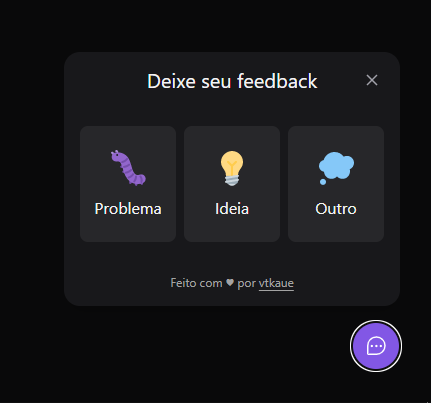

<h1 align="center">Widget</h1>

A Component Widget for feedback that can be used on any website.

<h1 align="center">
    
</h1>

<br>

# Layout

You can find the layout of this project [in this link](https://www.figma.com/community/file/1102912516166573468).

You must create an account to access and view.

# Improvements checklist

- [ ] Dark/Light theme
- [ ] create a mobile version


## 🧪 technology

This project was developed with the following technologies:
- [Vite](https://vitejs.dev/)
- [ReactJs](https://reactjs.org)
- [TypeScript](https://www.typescriptlang.org/)
- [Tailwind CSS](https://tailwindcss.com/)

## Clone repository

Create and go to the directory where you want to place the repository

```bash
  cd my-directory
```

Clone the project

```bash
  git clone https://github.com/pncsoares/nlw-return-impulse-web.git
```

Go to the project directory

```bash
  cd nlw-return-impulse-web
```

## Start the web application

Open terminal and execute the following command:

```bash
  npm run dev
```

# License

MIT
